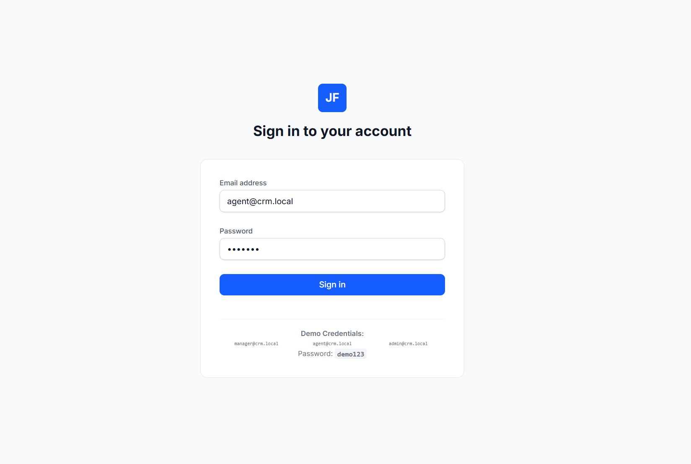
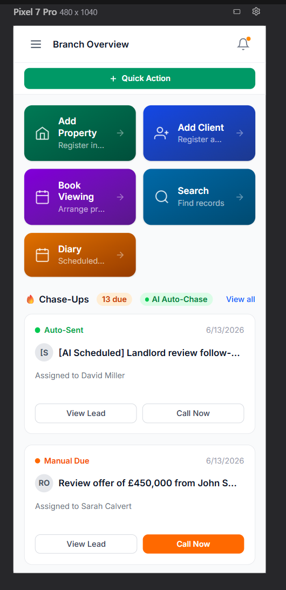
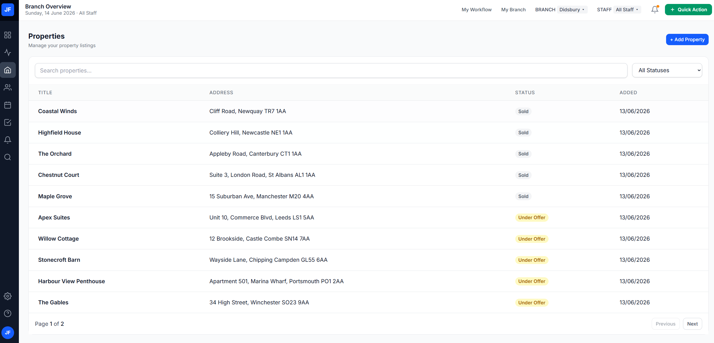
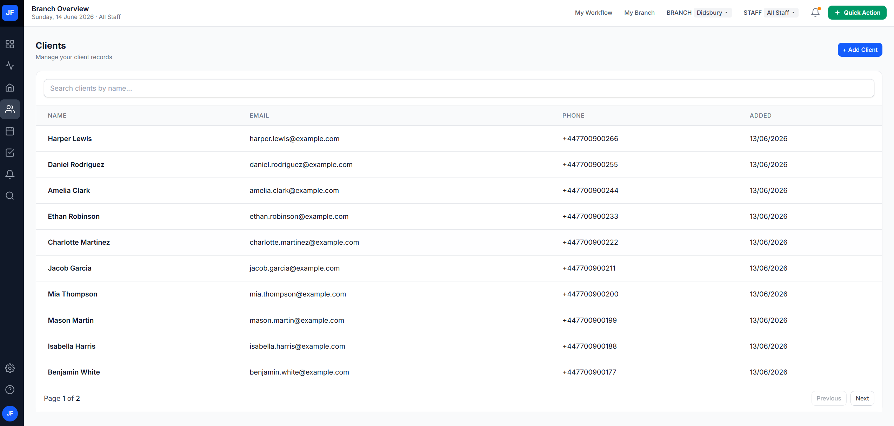
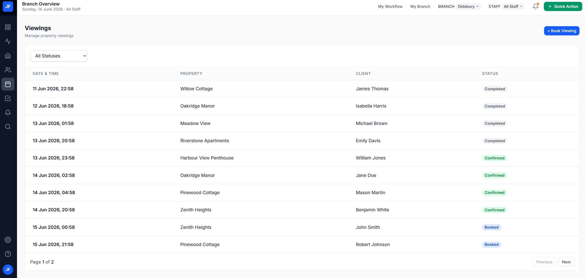
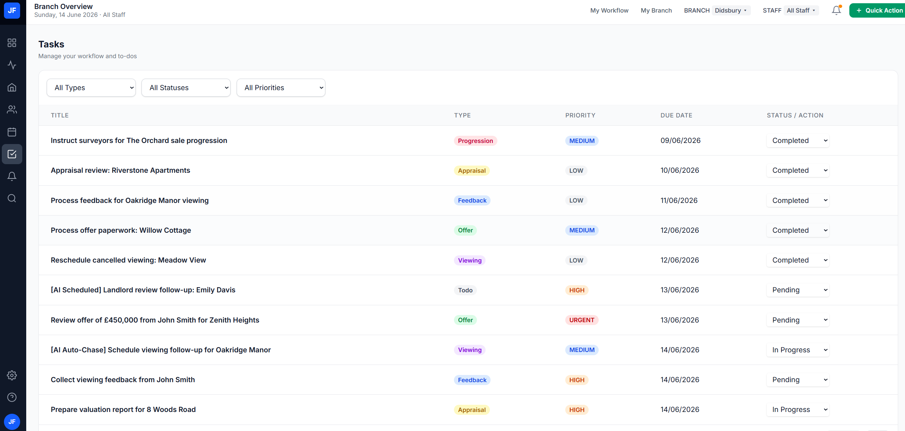
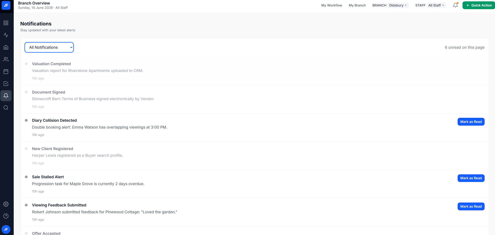

# Property Management CRM Dashboard – Application Walkthrough

## Overview

The Property Management CRM Dashboard is a full-stack web application built to help estate agents and property managers manage daily operational workflows.

The application provides a centralized dashboard for managing:

* Properties
* Clients
* Viewings
* Tasks
* Notifications
* Search
* Authentication

The system is implemented using:

* React
* TypeScript
* Tailwind CSS
* React Query
* Express
* Prisma ORM
* PostgreSQL
* JWT Authentication

---

# 1. Authentication

The application is protected using JWT-based authentication.

### Features

* Login page
* JWT token generation
* Protected API routes
* Protected frontend routes
* Axios authentication interceptor
* Automatic logout on unauthorized responses

### Demo Credentials

```text
Email: admin@crm.local
Password: demo123
```

### Screenshot



### Authentication Flow

```text
User Login
     ↓
Credential Validation
     ↓
JWT Generation
     ↓
Token Stored in localStorage
     ↓
Axios Authorization Header
     ↓
Protected Backend Routes
```

---

# 2. Dashboard

The dashboard acts as the operational command center of the application.

### Features

* KPI Overview
* Quick Actions
* Workflow Command Centre
* Notifications
* Upcoming Activities

### KPI Metrics

The dashboard displays live operational metrics retrieved from the backend:

* Total Properties
* Total Clients
* Total Viewings
* Total Tasks

### Screenshot (Light Theme)


### Screenshot (Dark Theme)


### Mobile Responsive Dashboard



---

# 3. Properties Management

The Properties module provides centralized property management.

### Features

* Property listing
* Property status tracking
* Property creation
* Search support
* Pagination

### Supported Statuses

```text
ACTIVE
UNDER_OFFER
SOLD
```

### Screenshot



---

# 4. Clients Management

The Clients module stores and manages customer information.

### Features

* Client listing
* Contact information
* Relationship tracking
* Linked property activities

### Supported Client Types

* Buyers
* Sellers
* Landlords
* Tenants

### Screenshot



---

# 5. Viewings Management

The Viewings module tracks property appointments.

### Features

* Viewing scheduling
* Property association
* Client association
* Status tracking

### Supported Statuses

```text
BOOKED
CONFIRMED
COMPLETED
```

### Screenshot



---

# 6. Task Management

The Tasks module functions as a workflow command centre.

### Features

* Workflow tracking
* Priority management
* Status updates
* Operational task organization

### Supported Categories

```text
VIEWING
FEEDBACK
OFFER
APPRAISAL
TODO
PROGRESSION
```

### Supported Priorities

```text
LOW
MEDIUM
HIGH
URGENT
```

### Supported Statuses

```text
PENDING
IN_PROGRESS
COMPLETED
```

### Screenshot



---

# 7. Notifications

The notification system provides operational awareness.

### Features

* Dashboard notifications
* Read/unread tracking
* Alert visibility
* Notification management

### Screenshot



---

# 8. Search Functionality

The application includes a global search capability.

### Features

* Property search
* Client search
* Real-time filtering
* Unified search interface

### Search Targets

```text
Properties:
- Title

Clients:
- Name
- Email
```

---

# 9. Responsive Design

The application is fully responsive.

### Mobile

* Hamburger navigation
* Responsive cards
* Adaptive layouts

### Tablet

* Compact navigation
* Optimized dashboard layouts

### Desktop

* Persistent sidebar
* Multi-column dashboard
* Full workflow visibility

### Responsive Screenshot


---

# 10. Backend Architecture

The backend follows a modular Controller-Service architecture.

```text
Routes
   ↓
Controllers
   ↓
Services
   ↓
Prisma ORM
   ↓
PostgreSQL
```

### Layers

#### Routes Layer

* API endpoint definitions
* Middleware attachment

#### Controller Layer

* Request parsing
* Response formatting

#### Service Layer

* Business logic
* Database operations

#### Validation Layer

* Zod schema validation

#### Middleware Layer

* JWT authentication
* Error handling

#### Shared Layer

* Utility functions
* JWT helpers

---

# 11. Security Features

Implemented security controls include:

* JWT Authentication
* Protected Backend Routes
* Protected Frontend Routes
* Axios Authorization Interceptor
* Zod Request Validation
* Environment Variable Configuration
* Automatic Logout on Unauthorized Access

---

# 12. Technology Stack

## Frontend

* React
* TypeScript
* Tailwind CSS
* React Query
* Axios
* Vite

## Backend

* Node.js
* Express
* Prisma ORM
* PostgreSQL
* JWT

---

# Conclusion

The Property Management CRM Dashboard successfully delivers the required MVP functionality through a clean, modular architecture and responsive user interface.

The solution demonstrates:

* Full-stack TypeScript development
* REST API design
* JWT authentication
* PostgreSQL data management
* Responsive UI implementation
* Modular architecture principles
* Production build readiness

Both frontend and backend applications successfully compile and pass production build validation.
